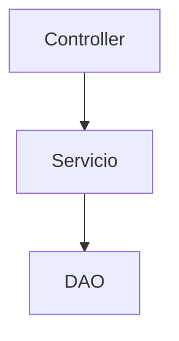

# Toki-web-server

Servidor web Node Espress sencillito

DAO = _data access object_

Controlador dice crear casa pero no sabe si existe. Se comunica con servicio.
El servicio llama al manipulador de datos (DAO). Si el DAO salta, el servicio recibe el error y comunica en consecuencia.

## Librerías empleadas

- Express
- Typescript
- Knex

## Knex

Empleo Knex para conectarme y realizar transacciones con una base de datos MariaDB.

### knexfile

Lo interesante de tener la knexfile es configurar las migraciones.
Nextjs soporta migraciones con sus command tools.

Las migraciones creo que es para facilitar gestión de cambios,
como hace Git.

### Comandos empleados

- Crear knexfile (más que nada para las migraciones)
`npx knex init`
- Crear migración (en el directorio que quieras)
`npx knex migrate:make init --migrations-directory src/db/migrations`
- Migrar a última versión
`npx knex migrate:latest --knexfile src/db/knexfile.js`
- Migrar a versión previa
`npx knex migrate:rollback`
